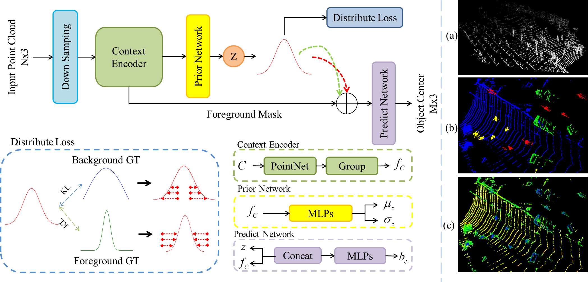
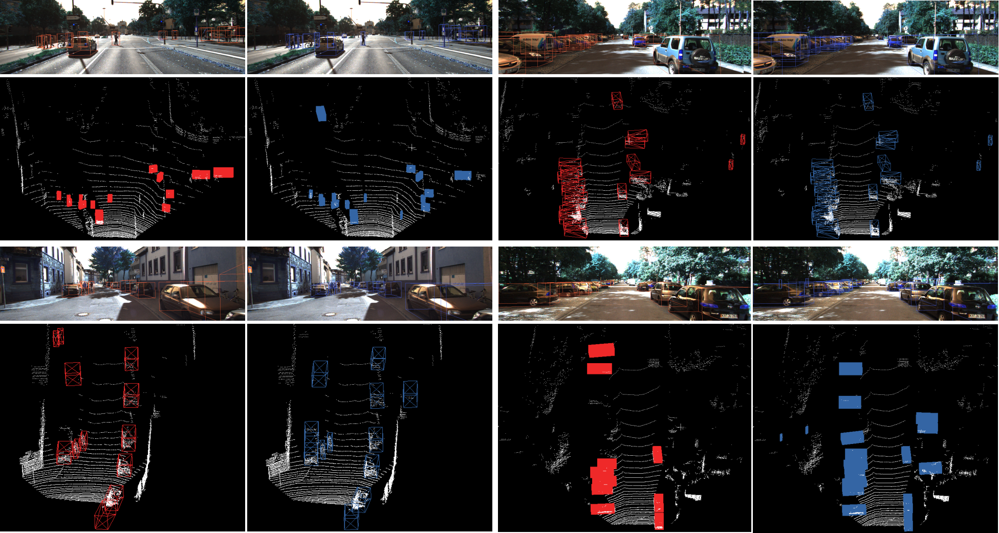
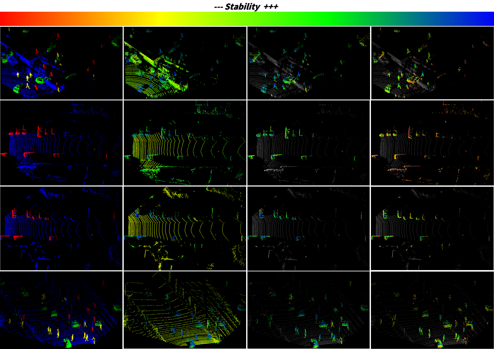
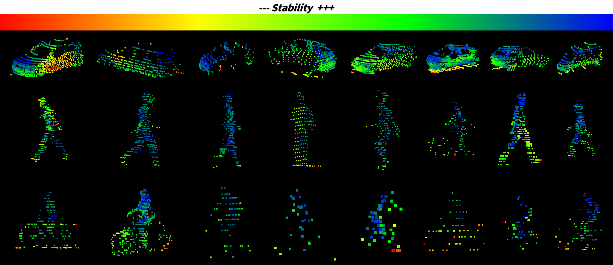
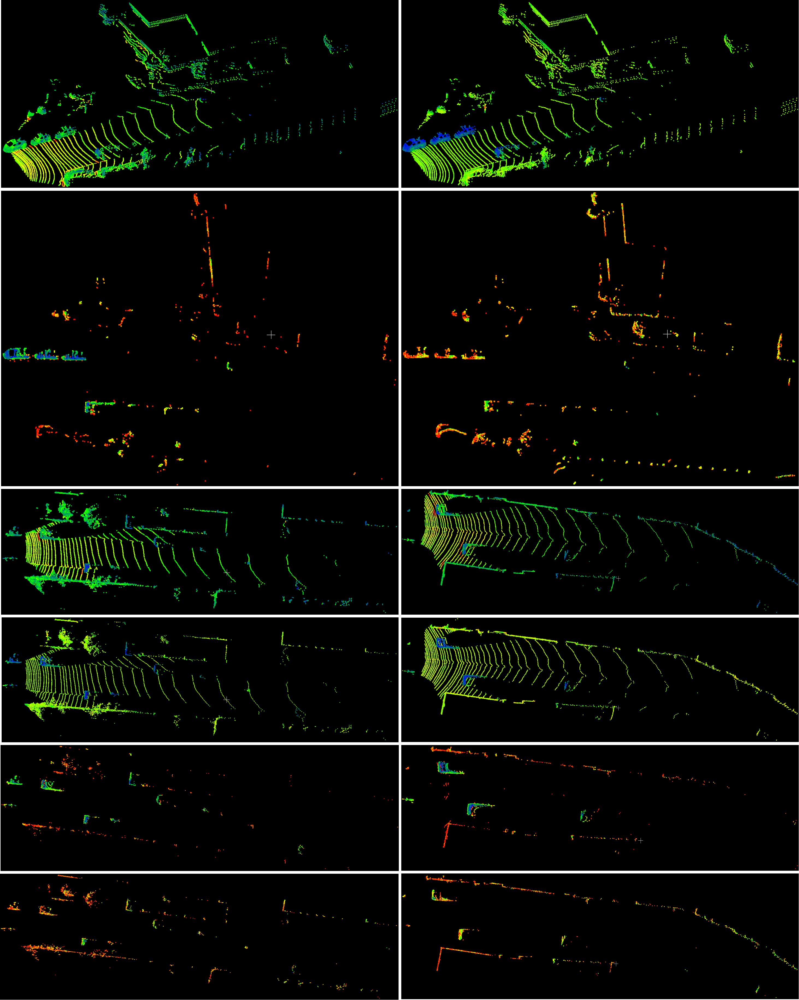

# SPSNet
This is the official implementation of "SPSNet: Boosting 3D Point-based Object Detectors with Stable Point Sampling".

>Currently, the primary focus of 3D point-based detectors is to enhance their performance by primarily increasing the recall rate of foreground points at the semantic level. However, this approach is suboptimal. On one hand, ground-truth annotations of 3D bounding boxes are inherently ambiguous due to occlusions, signal distortion, or manual annotation errors, which can obscure genuine semantic information. On the other hand, the saliency of each point varies. In this paper, we propose SPSNet based on Bayes theorem to explore the mapping relationship between the sampled point and the corresponding bounding box, which we call point stability. This is a plug-and-play module and used as the basis for downsampling instead of relying on semantic information obtained through hard supervision of 3D bounding boxes. We incorporate the proposed method into the most popular point-based detector, IA-SSD, called SPSNet-IA. On the challenging KITTI validation set, with only changes to the downsampling strategy, it obtains 1.18, 2.78 and 2.96 gains for the metric of $AP_{3D}$ on the easy, moderate and hard levels, respectively. In addition, SPSNet-IA outperforms all published point-based approaches by a large margin and ranks 1st among single-modal methods. We also design qualitative and quantitative experiments to explain the meaning of stability learned from SPSNet. These additional experiments demonstrate that SPSNet is not only a performance-enhancing model but also a saliency analysis model. The code is available at \textit{https://github.com/AlanLiangC/SPSNet.git}.

## Overall

The workflow of SPSNet.

## Pictures

- The detection results of IA-SSD.

- The stability-heatmap of scene.

- The stability-heatmap of instances.

- The comparison of SPSNet and SPSNet-S.

## How to use

- Train SPSNet

  `cd stability_generate`

  `python train.py`  if single GPU